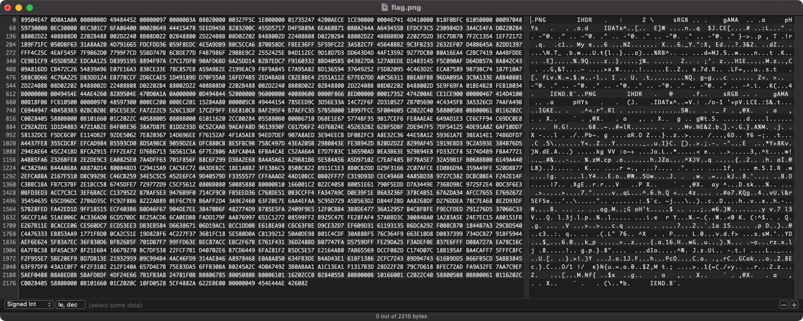
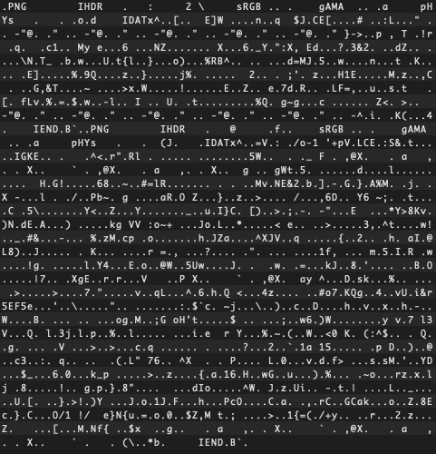
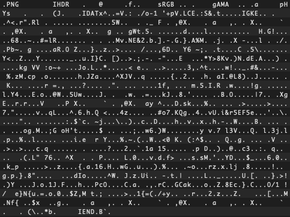
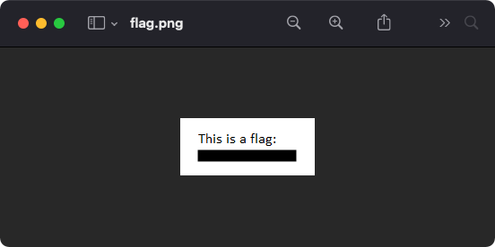

# Exfiltration

## What is the flag hidden in the image?

In order to analyze `image.png` we are going to need to exfiltrate the file's contents directly from the terminal session. For computer systems, hexadecimal is another method of representing binary data. Luckily there is a handy Linux utility called `xxd` , perfect for hex dumping.

Let's check for `xxd` using the `which` utility.

```text
$ man which

which: shows the full path of (shell) commands.

$ which xxd

/usr/bin/xxd
```

Now we can use the `xxd` utility to dump the contents of `image.png` in hexadecimal.

```text
$ man xxd

xxd: make a hexdump or do the reverse.

 -p: output in postscript continuous hexdump style. Also known as plain hexdump style.

$ xxd -p ./image.png

89504E47 0D0A1A0A 0000000D 49484452 00000097 0000003A 08020000 00327F5C 1E000000 01735247 4200AECE 1CE90000 00046741 4D410000 B18F0BFC 61050000 00097048 59730000 0EC30000 0EC301C7 6FA86400 00020649 44415478 5EED945B 8283200C 455D5717 D4F5B89A 6EA68B71 080A244A A643455B EFDCF3C5 230984D3 3A4CE4FA D02202B4 88002D22 408B08D0 2202B488 002D2240 8B08D022 02B48800 2D22408B 08D02202 B488002D 22408B08 D02202B4 88002D22 408B08D0 22027D2D 3EC7DB70 7F2C1354 1EF72172 1B9F71FC 050DBF63 31A8AA20 4D791665 FDCFDD36 059F8EDC 4E5A9DB9 B0C5CCA6 870B58DC FBEE36FF 5F59FC22 3A582C7F 45648BB2 9C3FB233 2632EF07 D48B645A 82DD1397 FFF4C25C 4EAF545F 7F9B62D0 7799F7CD 55BD747B 6CBDE77D F4B7986F 29BBE9C2 2552425E B4D112EC 9D18D7D3 DD643D4D 4AF13592 9277DCB0 B0A16EA4 C2BC7419 AA4BFDDE CE9B1CF9 455DB5B2 EDCAA125 D8395195 8894F97A C7C17DF0 90AFD6BD 6A25DD14 B2B7EDC7 F9160332 8BD405B5 043B27DA 127ABEDE D1483145 F5C090AF D64DB57A BA842C43 09A816DD CB472C26 54839A96 E07E16A3 83BCE33E 78C857EB A59A9B2E 2199EAC9 FBF9A845 E7A95A82 BD136594 37649252 F5D82095 4C463D2C ECA87589 9B73BC74 1B7F10A7 5B8C0D66 4C76A225 D83DD124 EB778CCF 2D6CCAE5 1D49189D D70F55AB 16FD74B5 2ED4BAD8 CB2E8BE4 2551A112 677E67DD A0C56311 8BEABFBB 96DA095A 3C9A133E A8B40801 2D22408B 08D02202 B488002D 22408B08 D02202B4 88002D22 408B08D0 2202B488 002D2240 8B08D022 02B48800 2D22408B 08D02202 B488002D 5E9F69FA 01BE4B28 FEB1B034 B0000000 0049454E 44AE4260 8289504E 470D0A1A 0A000000 0D494844 52000000 96000000 40080600 0000F866 8ED00000 00017352 474200AE CE1CE900 00000467 414D4100 00B18F0B FC610500 00000970 48597300 000EC200 000EC201 15284A80 000005CB 49444154 785EED9C 3D56E33A 14C72F6F 2D310527 2B705690 4C4345FB 3A5326CD 74AFA49B C6944947 4B4583B3 02BC020E 05CE5E3C FA7222C9 526C13DF 17C2F9FF E6E810CB BAF295F4 B7AEFC35 57B58000 18997FCC 5F004605 C2022C40 58800508 0BB00061 0116202C C0028405 5880B000 0B101660 01C2022C 40588005 080BB000 61011620 2CC00284 055880B0 000B6710 D68E1E67 5774BF35 9B17CEF6 FE8AAEAE 649AD1E3 CE6CFF94 C69DC0E8 C292A2D1 1D1D48B3 4721AB2E B4F0BE36 38A7D87E 81DD233D 6C52CAAB 9AEAFA8D 9613930F C617D6F2 4D76B24E 452632B2 62BF5DBF 2DE947F5 7DF54125 4DE91A82 6AF10DD7 58132DCE F5DC6C0F E114DB2F 92DE5062 7E820367 14D696EE F76152AF 4F1A5AEB 94ED7DEF 907A8AED 3E94EECB DF0B2FC3 A8E32C36 44E58A12 59361A7E 3BEA14E1 74B6DFD7 A4437FE8 355CDC8F EFCAD984 B5593CD0 8D5A9BC8 9059D2EA DFC880CB 8E5FBC9B 758C497D 43EA205B 2980843E FE3B942D B20D2D22 8299AF45 1919EBD3 9C2A593E 384B76D5 294EAE64 45C241BD BFCA2915 FFF2EAF2 D76B6713 56561C3A 6F7E2B06 A8FCA04A 6FBA4CAE C52AA6A4 E7D7F83C 136590AD 0EA3B63E 929B94E8 FD332CF8 5E74D4B9 FBA47721 A4BB5FA6 2326BFE8 2E2DE9C3 EA0825E0 7A4DFF63 701F856F B8C6F299 D3BA2E68 BA4A5A61 A29B81B6 5E584A56 A5D97102 C7EAF485 BF7BA5E7 32A59B1F B068BB00 6149A440 4C3829A6 B44A868A AB87AD14 80084BD3 C29415A9 CAC5EC72 0A3DEB2C 1BE1ABB2 3FE3B6C5 8508CB22 B911C1E3 8B0CB2DD D29F3166 2C07AFCE ED0B6D9A 359A49FE 520D8B77 2EFCABBA 2167F510 DBC9929E C46CB259 34E5C5C5 452E6FC4 9D40579D F3355577 CFFAAAD2 4AD10BCC 0B02FF77 C319D93D CEC49A6B 4A85BD38 9727C382 DCBC0BE4 F242E14F C3BBC1BA FB7C37BF 2E1BCC58 6745DFE7 729772D9 C5CF5612 080BB080 50085880 B0000B10 166001C2 022C4058 80051E61 790F5EDD D7A3449E 736BD9BC 9725F2E4 0DC3F6E3 0BFD3ED3 ACC7C3C1 3EF6BACC C1379522 B7BAF5E3 9476B9F0 714CF9C0 FB5EED36 C768DE51 0B3CCFF4 FA347A9C D0E39F1E B6A3236F 378C4B51 67A2DA34 AFCC7655 E7692672 35454635 65CD96DC 27B6D35C FC92F8B6 8222AB89 0EF6C7E9 B6AFF2D4 3A9E2460 63F20E7E 6AA4EFAA 5C95D729 A5B563D2 D844F2BD AA8268DF D276DDEA 78C7EA68 8E2D93DF 57B28FED FA42ED1D 9FF18515 ECF403B6 B0D46F67 904DE7EE 3B470B6F 482774D9 B785E5FA 2409F9E5 12F0CBB4 3B8DE477 36A12957 B4CBFBFE F9ECFDED 791276D5 37066C33 56CCF1A6 51AE006C AC336AD0 6CD570DC BE25ACD6 6CA0EDBB FADD179F AAB76997 651C1272 08599FF2 B925C47E FE28FAF4 57ABBD3C 30084BA0 1A283A5E 24E7EC15 A80151FB E267B11E 8CACCE06 CE560DC7 ECD53EE3 DB3EB584 D6638671 06D19AC1 BCC1DD0B E618EA98 C6C63FBE D9CE32D7 EF609D31 61193135 B6DCA292 F008CB70 1844B7A3 29CBD540 C4A76333 EB853AA9 1771FBD0 0CA2C51E 19D828F6 4C227F37 36B1FC18 5E580D0A CB139212 50A0DE98 B01C4CDF 30AB8BF5 76C364F9 663E10D8 D0837399 734DCB27 91BF5944 AEF6E624 5F83A7EC 36F830D6 BFB26B5F 701DB7F7 99FFD63E BEC87ACC EBC2F67B E761F431 36D248BD B07747FA D5759DFF FE29DA25 F3ADEF0E 837E6FFF D08A727A EA78C16C 6A7FBC38 BFA5AC97 8F21E6B4 16679270 BC7DF538 22FCF7B1 D40702E6 B7CD6449 6FA281F2 B5DC5E57 E2164AB0 7AB65569 DCCF082D C174D07C 18B195AF BA4CAFF7 5FFFC8FC F2F955E7 5BE20EF9 BD7DB13E 21932959 09C994B4 4AC46FD9 314AE846 A8978468 E0A8A850 634FB3DE B4AD43E1 61BF1386 2CFC7243 89D94743 616B9DD5 B66FB5CD 5ABB3845 63F97DF0 43A1C0F7 4F2F3102 212F140A 657D4E7B 75E83DA5 6FFB30BA B0245A2C 4D0A7492 3B0ABAA1 A1C13EA1 F1317B3D 28D22F2B 79C7D618 BFEC72AD FA9A32FE 7AA7C9EF 5AEF0408 08ABED8B 5BAFDBDF 4DF24E66 7B1FB3A8 24781F0B B0806785 8005080B B0006101 16202CC0 02840558 80B0000B 10166001 C2022C40 58800508 0BB00061 0116202C C0028405 5880B000 0B101660 01C2020C 10FD0528 5CF4882A 622E0E00 00000049 454E44AE 426082
```

Now that we have the hex code of `image.png` we can load a hex editor on our main system and paste the contents of our hex dump. This allows us to analyze the file contents in various representations and even save the file to our system for further analysis in other software. For this example, I am going to use [Hex Fiend](https://hexfiend.com/).



Right at the start, we can see the hexadecimal representation of our file to the left and the plain text \(ASCII\) representation to our right. We can save the file by navigating to `File -> Save As...`, give it a name with an appropriate filetype such as `image.png`, click `save` and open the saved file in an image viewer.


No flag here. Let's take a closer look at the plain text representation of our hex dump for any patterns.



For the most part, everything looks like garbage data with the exception of a few words and acronyms we can pick out of the seemingly random characters. These are known as `strings` , which are often bits of metadata in the filetype specification. Here are the important bits:

```text
 PNG: Filetype identifier
IDAT: Image start
IEND: Image End
```

Reference: [Wikipedia - Portable Network Graphics](https://en.wikipedia.org/wiki/Portable_Network_Graphics#File_header)

Upon investigation, we notice that this file has two headers, once at the beginning of the file and again at the byte 625 mark. This is commonly seen when one file is being concealed within another in an effort to exfiltrate or conceal data.

> Steganography is the science of hiding information. Whereas the goal of cryptography is to make data unreadable by a third party, the goal of steganography is to hide the data from a third party.
>
> Source: [garykessler.net - Steganography](https://www.garykessler.net/library/steganography.html)

If we strip away the first layer we can reveal the image hidden within the file and obtain our flag.



Finally, navigate to `File -> Save As...`, give it a name with an appropriate filetype such as `flag.png`, click `save` and open the saved file in an image viewer.



